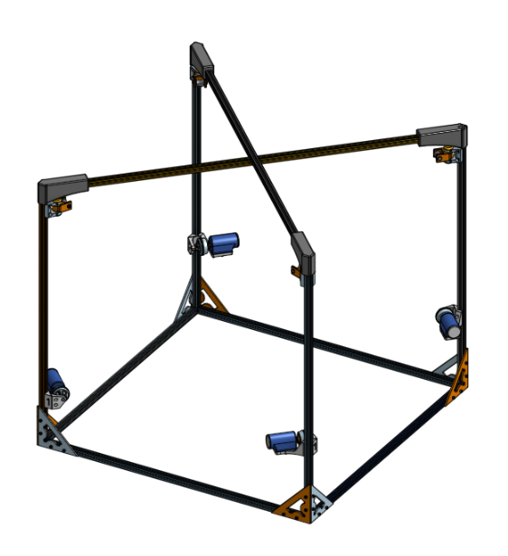

# Open-Source Mechanical Assembly Guide

This project consists of five main subsystems that must be assembled to complete the system:

- 4 pulleys  
- 4 winches  
- 1 frame  
- 1 payload  
- 1 homing tool

Once assembled, your build should look like the image below:

![[../images/Whole_assembly.png]]

## Table of Contents

1. [Bill of Materials (BOM)](#1-bill-of-materials-bom)  
2. [Frame Assembly](#2-frame-assembly)  
3. [Winch Subsystem](#3-winch-subsystem)  
4. [Pulley Subsystem](#4-pulley-subsystem)  
5. [Completing the Frame](#5-completing-the-frame)  
6. [Electrical Box](#6-electrical-box)  
7. [Homing Tool](#7-homing-tool)  
8. [Payload](#8-payload)  
9. [Final Assembly](#9-final-assembly)  

---

## 1. Bill of Materials (BOM)

This project uses a combination of 3D printed parts, laser-cut plywood, and off-the-shelf components.

- A 3D printer with a minimum bed size of **20cm x 20cm** is required, capable of printing in **PLA and TPU**.
- A **laser cutter** is needed for some parts.

| Description                             | Quantity     | Link                                                                                                                     |
| --------------------------------------- | ------------ | ------------------------------------------------------------------------------------------------------------------------ |
| 20mm x 1000mm aluminium extrusion       | 6            |                                                                                                                          |
| 20mm x 1220mm aluminium extrusion       | 2            |                                                                                                                          |
| 90° 3-way aluminium extrusion connector | 4            | [Amazon](https://www.amazon.ca/dp/B08C9Q2TGW)                                                                            |
| M5 x 5mm set screw                      | 16           |                                                                                                                          |
| M5 T-nuts for 20mm extrusion            | 62           |                                                                                                                          |
| M5 x 10mm socket head screw             | 62           |                                                                                                                          |
| M3 x 6mm x 5mm brass insert             | 20           |                                                                                                                          |
| M3 x 10mm countersunk screw             | 4            |                                                                                                                          |
| M3 x 10mm socket head screw             | 20           |                                                                                                                          |
| M3 x 20mm socket head screw             | 6            |                                                                                                                          |
| M3 x 30mm socket head screw             | 2            |                                                                                                                          |
| M4 x 16mm socket head screw             | 4            |                                                                                                                          |
| M3 nut                                  | 8            |                                                                                                                          |
| M2 x 10mm socket head screw             | 4            |                                                                                                                          |
| M2 washer                               | 4            |                                                                                                                          |
| 6-32 x 1" machine screw                 | 16           |                                                                                                                          |
| Aluminium hub for 6mm D-shaft           | 4            | [link](https://ca.robotshop.com/products/servocity-1310-series-hyper-hub-6mm-d-bore?qd=2f754479f71924b80878dfa4e2ce8d13) |
| 8lb braided fishing line                | 1 roll       |                                                                                                                          |
| Super glue                              | small amount |                                                                                                                          |
### File Resources

- STL files for 3D printing: [`/doc/STL`](../doc/STL)  
- STEP files for laser cutting or modification if you don't own a laser cutter : [`/doc/STEP`](../doc/STEP)

Access the full CAD model via Onshape:  
[Onshape Link](https://cad.onshape.com/documents/390c295f6aa4808e63a0329a/w/15b9467409059843a81b2a98/e/3b631072c0b4a11c9089c144)

---

## 2. Frame Assembly

You will need to 3D print the parts in [`/doc/STL/Frame`](../doc/STL/Frame) and laser cut the parts in [`/doc/STEP/Frame`](../doc/STEP/Frame).

### Required Parts

#### 3D Printed

| Name         | Quantity |
|--------------|----------|
| Top_Frame1   | 2        |
| Top_Frame2   | 2        |
| Top_Middle1  | 1        |
| Top_Middle2  | 1        |
| Triangle1    | 4        |
| Triangle2    | 4        |

#### Hardware

| Name                         | Quantity |
|------------------------------|----------|
| M3 x 6mm x 5mm brass insert  | 16       |
| M5 x 5mm set screw           | 12       |
| M3 x 10mm socket head screw  | 4        |

### Step-by-Step

#### Step 1
Assemble the 6 aluminium extrusions (1000mm) using the 4 corner connectors as shown below:

You should now have a basic frame like this:

Secure the extrusions in place with the M5 set screws.

#### Step 2
Install the triangle brackets using M5 x 10mm screws and loosely attached T-nuts. Align the T-nuts with the extrusion slots, insert, and tighten.

Each corner should look like this:

---

## 3. Winch Subsystem

3D print all the files in [`/doc/STL/Winch`](../doc/STL/Winch) 4 times, but print the motor support variants only once each.

### Required Components

| Name                        | Quantity |
| --------------------------- | -------- |
| M3 x 6mm x 5mm brass insert | 16       |
| M3 x 10mm screw             | 16       |
| M5 x 10mm screw             | 12       |
| M5 T-nuts                   | 12       |
| 6-32 x 1" screw             | 16       |
| Aluminium hub for 6mm shaft | 4        |

### Step-by-Step

#### Step 1
Insert the brass inserts into the underside of the motor casing.

#### Step 2
Assemble the winch following this exploded diagram:

#### Step 3
Attach each winch to the frame using M5 screws and T-nuts. Align with the slots and tighten at the desired height.

Final result:

---

## 4. Pulley Subsystem

3D print each file in [`/doc/STL/Pulley`](../doc/STL/Pulley) 4 times.

### Required Components

| Name                         | Quantity |
|------------------------------|----------|
| M5 x 10mm screw              | 16       |
| M5 T-nuts                    | 16       |
| M3 x 10mm countersunk screw  | 4        |
| M2 x 10mm socket head screw  | 4        |

### Step-by-Step

#### Step 1
Assemble each pulley using the exploded view:

Note: Screws are driven directly into plastic; apply firm pressure if needed.

#### Step 2
Mount pulleys on the frame using M5 screws and T-nuts.

Final result:

---

## 5. Completing the Frame

### Steps

1. Attach a `Top_Frame1` to each side of a 1220mm extrusion.  
2. Repeat with `Top_Frame2`.  
3. Assemble as shown below:

   

4. Insert brass inserts into `Top_Middle1`.  
5. Attach `Top_Middle2` using M3 x 10mm screws.

Final frame:

   

---

## 6. Electrical Box

Print each part in [`/doc/STL/Electrical_box`](../doc/STL/Electrical_box). Modify as needed to fit your electronics.

### Required Components

- 2 M3 x 30mm screws

### Steps

1. Secure electronics using screws.  
2. Wire according to the diagram in [`/doc/Electrical`](../doc/Electrical).  
3. Mount the E-stop button on the cover.  
4. Insert two M3 x 30mm screws into each hinge side of the box.

---

## 7. Homing Tool

Print the parts from:

- [`/doc/STL/Homing`](../doc/STL/Homing) 

Laser print the parts from:

- [`/doc/STEP/Homing`](../doc/STEP/Homing)

### Step

Glue the 3D printed part onto the part labeled `homing3`.

Final result:

---

## 8. Payload

The payload houses the Raspberry Pi, Pi-camera, and battery.

Files available here: [`/doc/STL/Payload`](../doc/STL/Payload)

### Recommended:  
Print attachment parts in TPU for better flexibility (PLA is acceptable).

### Required Components

| Name                        | Quantity |
| --------------------------- | -------- |
| M3 x 6mm x 5mm brass insert | 2        |
| M3 nut                      | 8        |
| M3 x 20mm socket head screw | 6        |
| M4 x 16mm socket head screw | 4        |

### Steps

1. Insert brass inserts into the top of the payload body.  
2. Slide the Pi camera into its holder and connect the cable.  
3. Assemble the payload using the exploded view:

4. Insert the battery into the upper compartment.  
5. Connect the Raspberry Pi to the battery and camera.

---

## 9. Final Assembly

You're now ready to string the fishing line.

### Required Components

| Name         | Quantity |
|--------------|----------|
| Fishing line | 1 roll   |
| M2 washer    | 4        |

### Step-by-Step

#### Step 1
Pass the fishing line through the winch pulley’s small hole. Use tweezers if needed. Tie a knot around a M2 washer to prevent slippage and wind ~2–3m of line onto the pulley. Repeat for all winches.

#### Step 2
Route the line through the pulleys and attachment holes. Tie knots and test their strength.

---

## Congratulations

You’ve completed the full mechanical assembly.

---

