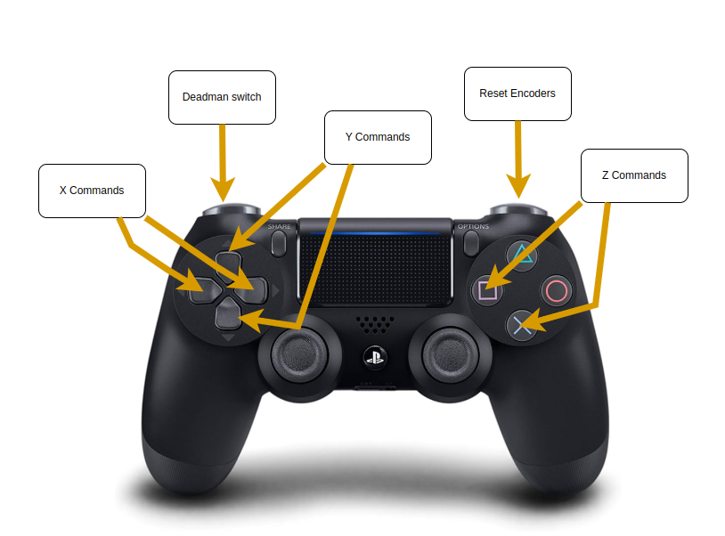
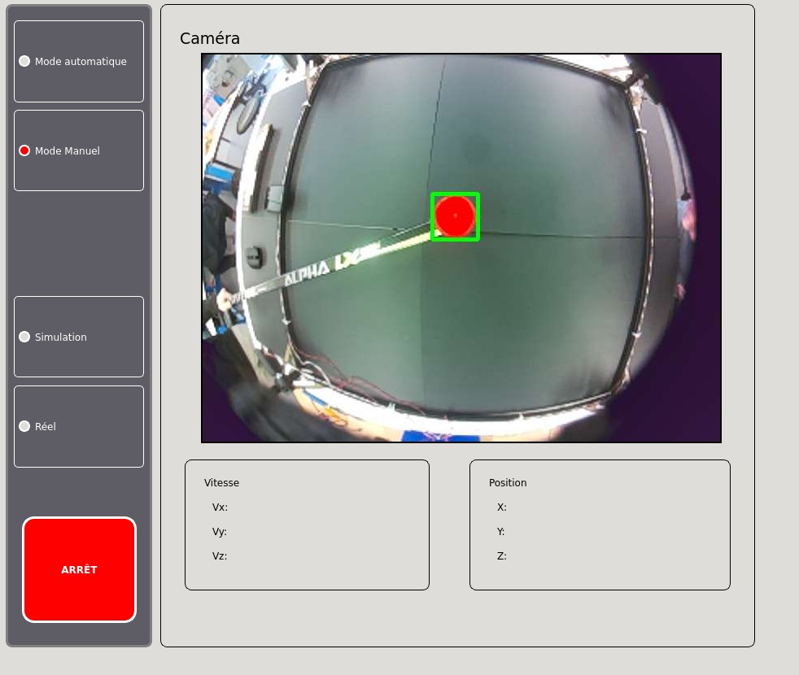

# Aetos Development Environment

## Table of Contents

- [Opening the Devcontainer](#opening-the-devcontainer)  
- [Development Inside the Container](#development-inside-the-container)  
- [Running the Code](#running-the-code)  
- [Simulation Mode](#simulation-mode)  
- [Controls](#controls)  
- [Homing Procedure](#homing-procedure)  
- [Graphical Interface](#graphical-interface)  
- [Vision System](#vision-system)  

---

## Opening the Devcontainer

When VS Code detects the devcontainer configuration, a notification will appear in the bottom-right corner. Click **"Reopen in Container"** to launch the devcontainer.

Alternatively, you can:

1. Press `Ctrl + Shift + P`  
2. Type `"Dev Containers: Reopen in Container"`  
3. Press Enter  

> **Note:** Opening the container for the first time or rebuilding the environment may take a few minutes. Sit back, relax, and enjoy the nonsense logs in the terminal.

---

## Development Inside the Container

Inside the container, all dependencies specified in the `Dockerfile` are available.

- **Terminator** is installed (a terminal multiplexer useful for ROS2 development). To launch it, open a VSCode terminal and run:
  
  ```bash
  terminator
  ```

- The `.bashrc` file includes a helper command to build the ROS2 workspace easily. Simply run:
  
  ```bash
  b
  ```

---

## Running the Code

To launch the full application (including nodes and GUI), run:

```bash
ros2 launch aetos_auxiliary aetos.launch.py
```

> **Note:** This will only send motor commands if the computer is connected to the ESP32 via serial port.

---

## Simulation Mode

For development purposes, Aetos also supports a simulation mode. To launch it, use: modify the aetos.launch.py launch file to integrate it in the launch.

---

## Controls

Aetos is controlled using a Bluetooth controller. Keybindings can be modified in the `joy_demux.py` file located in the `aetos_joy` ROS2 package.



---

## Homing Procedure

To prevent error accumulation and drift, Aetos requires homing every time it is restarted.

1. Place the payload on the designated homing area (see [Mechanical Assembly](../Mechanical/mecanical_assembly.md)).
2. Use the controller to reset the encoders.

> **Caution:** Ensure motor power is **disconnected** before resetting encoders to avoid unintended movement or damage.

---

## Graphical Interface

The GUI allows users to:

- Toggle between control modes
- Activate a software emergency stop (E-Stop)
- Monitor linear velocity and payload position



---

## Vision System

To enable vision:

1. Ensure all relevant nodes are launched.
2. Establish a successful connection between the main computer and the Raspberry Pi.
3. Once connected, the camera feed will appear in the GUI.
4. Use the GUI buttons to toggle between teleoperation and autonomous control.
