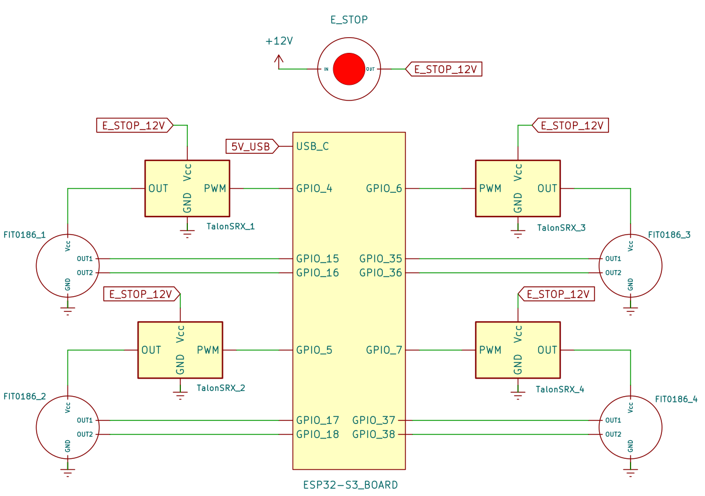

# Electrical Assembly

## Build of Material

| Item | Description | Quantity | Unit Price | Total Price | Link |
|------|------------|----------|------------|-------------|------|
| 1    | Freenove ESP32-S3-WROOM Board Lite | 1  | $15.00  | $15.00  | [Lien](https://www.amazon.ca/Freenove-ESP32-S3-WROOM-Dual-core-Microcontroller-Wireless/dp/B0DHJZ1V81/ref=sr_1_2_sspa?crid=1B4A2JCWQI391&dib=eyJ2IjoiMSJ9.THRzgrH9xzrWA8Pb5f05B1VK-JLh640LUQ-FGH3orTxq6ypjaEm_Vtgylh66I8whY9d1SGNeWJbbVYzJ0tR376loh28D_8_sfKrOfmqt4_wcY7YRhDa298uh0N2kHe1_vSVb8hJNNjmGUYbRXZR2SVoYpZrnMYWP8bsWsYXRHQ0GhlJQgj10_yFgO-HIt8oiI3DNR9aK36TgX-Cj9IRYz-8PugHPgYGpl_DMyHOUTOF6tQnwuE53UUl9c1rMg5vUayWQ7vTv2OR-_vxrHC_Jcu2eSdlboBZp-TMFhZhu8EM.P-cSpMf0akz0NWtyhl-a8yByT7WfHLyIjcYCrhITiSY&dib_tag=se&keywords=devkit%2Besp32%2Bs3&qid=1743617088&sprefix=%2Caps%2C207&sr=8-2-spons&sp_csd=d2lkZ2V0TmFtZT1zcF9hdGY&th=1) |
| 2    | Freenove Breakout Board for ESP32 | 1  | $18.00  | $18.00  | [Lien](https://www.amazon.ca/Freenove-Breakout-ESP32-S3-Terminal-Outputs/dp/B0CD2512JV?psc=1&pd_rd_w=zkDC5&content-id=amzn1.sym.1d3fa88f-aa61-4d59-895c-470dda2309ea&pf_rd_p=1d3fa88f-aa61-4d59-895c-470dda2309ea&pf_rd_r=7K537AHA623XYYDM2T7Y&pd_rd_wg=d0Mc5&pd_rd_r=3e31c15b-523c-4d60-bafb-e4574344c26f&ref_=sspa_dk_detail_1&sp_csd=d2lkZ2V0TmFtZT1zcF9kZXRhaWxfdGhlbWF0aWM=) |
| 3    | FIT0186 DC Motor | 4  | $26.59  | $106.36 | [Lien](https://www.digikey.ca/en/products/detail/dfrobot/FIT0186/6588528?gQT=1&fbclid=IwZXh0bgNhZW0CMTEAAR0eucoqhbc58q84bukTcta8T7SBVMd6oGZHQpG-f3r5hTY8GGKjYU6g7r8_aem_h8BbOyiPHGj3od-UkTakUA) |
| 4    | Talon SRX Motor Controller | 4  | $131.00 | $524.00 | [Lien](https://store.ctr-electronics.com/products/talon-srx?srsltid=AfmBOoo8rhUIWV4VTK7PCz8OXvGWIPzDqzc9h7fAqZY5b_mIVFueruF1) |
| 5    | 35A Terminal Block (6 Position, Screw) | 2  | $7.00 | $14.00 | [Lien](https://www.amazon.ca/Joinfworld-Terminal-Position-Pre-Insulated-Jumper/dp/B0B24FZWPH/ref=sr_1_15?crid=2RT7TV79JCZFA&dib=eyJ2IjoiMSJ9.wmg5rmHELyxCOG_MmPmoILliJank83l0_dkljR_AExgZHCr2o6TaJb6Eqd7fkORjZBH8U1e4G0gz6rUnCKYbdQ1EvKPNgUPm6WwjEskSOWEYi7NSo0g3kb1jLZp6fBaspYVQpwHEd4IhdYgZZA17qUdaB7AM0ZX6dne2wqjXV9woahGNUn6M5Es7TQEhDkdtMrUA1CB_g4oixUV1XTwsMTDnHSJ4lz8xqeFZbjK5OgvMrZYmsc7w46NzUTKF3Lg2iBp4WpRVt81abT51s4DmryjeDUHi5EBJNrqkae5BKng.PBTaIgwcktlnopUdu-WNncpe8YzXiWmVu8FKVTx2jU0&dib_tag=se&keywords=bornier&qid=1743615661&sprefix=bornier%2Caps%2C71&sr=8-15&th=1) |
| 6    | Emergency Stop Push Button (10A) | 1  | $17.00 | $17.00 | [Lien](https://www.amazon.ca/mxuteuk-HB2-ES544-Mushroom-Emergency-Warranty/dp/B07R8PTTDX/ref=sr_1_7?crid=GBF2WH7ZH64W&dib=eyJ2IjoiMSJ9.EPcoS05P89n8QBP-en8PJrUOvRp5F-POP9hOiaaw6NWfN0Y2gSnM4PX3u9dESuQZmHutP_63T1ElpkwsMdaw6dpOiTnWyHp3drR0pg62atYQfcKoLdC28TVV1BVy3NC1AeppdHW3oGdmI5HI4cpiMi7lDf8j0QvBS_SLOwQqJlKuwWRFxeQ-VgcWoqVPWPsMeqtW5m5GPxGxSWHRwYyt3zFJvXvDGfkSRhgWilMzePyxhqRBu6XkvHnEF_BycsOPAGLlPQhWjDRXpE_0biKufjO3gaF9MyYzIzti4KuaqrU.3XpjRj57vACrNg677B2MAQZ0E3XlEpuqdDHsTuedTzA&dib_tag=se&keywords=e-stop&qid=1743615817&sprefix=e-stop%2Caps%2C101&sr=8-7) |

**Total:** 694.00$

**Note:** We are using Talon SRX motor controllers because we had them for free. They are largely overkill for our application, as they offer advanced features like current sensing and CAN bus communication, which are not necessary for our setup. If you are building a similar system from scratch, a simpler and more cost-effective motor driver would be a better choice.

## Wiring Overview

- **Motor Power Supply:**  
  We will be using a DC power source rated for a maximum of **6.4A**, connected via an **XT60 connector**. XT60 was chosen as it was readily available, but any connector rated for at least **6.4A** will suffice.

- **ESP32 Power Supply:**  
  The ESP32 board is powered through its **USB-C port**, which also facilitates serial communication.

- **Grounding:**  
  All the **grounds (GND)** of the devices must be connected together at a single point, typically via a **terminal block**. This ensures a common reference for all components, which is crucial for proper operation and avoids ground loops or voltage differences.

- **12V Power Distribution:**  
  Devices that operate on **12V** (such as the DC motors and the Talon SRX motor controllers) should be connected to a **dedicated 12V terminal block**. This keeps the high-power components separate from the low-power ones (like the ESP32) and helps ensure proper voltage distribution to each device.

- **Emergency Stop Button Placement:**  
  The **Emergency Stop (e-stop)** button should be placed between the **12V power source** and the **12V terminal block**. This ensures that if the e-stop is pressed, it will immediately cut off the power to the 12V components, providing an effective safety measure.

---

### Wiring Steps:
1. **Connect the ESP32 to the Breakout Board:**  
   Begin by securely plugging the ESP32 board into the breakout board.

2. **PWM Motor Control:**  
   Next, connect the **PWM pins** of the **Talon motor controllers** to the appropriate GPIO pins on the ESP32.

3. **Encoder Connections:**  
   Afterward, wire the **encoder pins** to the corresponding GPIO pins on the ESP32.

4. **Connect Grounds:**  
   All the **ground (GND)** pins from the ESP32, motor controllers, and other components must be connected to a **single terminal block** to establish a common ground.

5. **Connect 12V Devices:**  
   The devices that need **12V** power (DC motors, Talon SRX controllers, etc.) should be connected to the **12V terminal block**, ensuring they receive the correct voltage.

6. **Place the Emergency Stop Button:**  
   Position the **e-stop** button between the **12V power source** and the **12V terminal block**. This will allow it to cut power to the 12V components if activated.

---

--- 

### Additional Recommendations
- Ensure all connections are properly insulated, particularly the power supply and motor controller pins, to prevent short circuits.